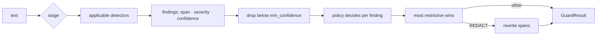

# guardrail — a safety gateway for LLM inputs and outputs

[](https://github.com/darrshangovender/guardrail/actions/workflows/tests.yml)
[](LICENSE)
[](https://python.org)
[](pyproject.toml)

> Inspect what goes **into** your model and what comes **out** of it. Prompt-injection detection, PII redaction, groundedness checking against retrieved context, and structured-output repair — behind one `Guard`, with a policy layer that decides allow / flag / redact / block.

**Why this exists.** Most LLM features ship with no input validation and no output validation. The prompt goes straight to the provider and the response goes straight to the user. That's fine until someone pastes a card number into the chat box, or the model quotes a figure the retrieved documents never contained.

**One of four on inference economics:** [cascade](https://github.com/darrshangovender/cascade) (route to the cheapest model) · [thinking-loop](https://github.com/darrshangovender/thinking-loop) (spend more when it's hard) · [context-compress](https://github.com/darrshangovender/context-compress) (shrink the input) · `guardrail` (validate both ends). Also the general case of [sql-guardrails](https://github.com/darrshangovender/sql-guardrails), which does this job for one narrow surface: LLM-generated SQL.

---

## The result

Reproducible and fully offline (`python benchmarks/run.py` — no API keys, no model downloads):

| detector | detection rate | **false positives** | precision | F1 |
|---|---:|---:|---:|---:|
| injection | 100.0% | **0.0%** | 100.0% | 1.00 |
| pii | 100.0% | **0.0%** | 100.0% | 1.00 |
| groundedness | 80.0% | **0.0%** | 100.0% | 0.89 |

*25 injection attacks vs 25 benign prompts · 7 PII positives vs 6 negatives · 5 hallucinated answers vs 5 grounded — 63 hand-written cases, committed at `benchmarks/corpus.py`. Not a public benchmark: 100% on 25 attacks is not 100% in the wild.*

**Read the false-positive column first.** Detection rate on its own is meaningless — flag everything and score 100%. What decides whether a guard survives contact with production is how often it blocks real users, because a noisy guard gets switched off within a week. The benign corpus is deliberately adversarial in the other direction: near-miss phrasing like *"please ignore the typo in my last message"* that naive keyword matching gets wrong.

## Quick start

```bash
pip install -e ".[dev]"      # zero runtime dependencies
python benchmarks/run.py
```

```python
from guardrail import Guard, BALANCED
from guardrail.detectors import InjectionDetector, PIIDetector, GroundednessDetector

guard = Guard([InjectionDetector(), PIIDetector(), GroundednessDetector()], policy=BALANCED)

# 1. Guard the input.
inbound = guard.check_input(user_prompt)
if not inbound.allowed:
    return refuse(inbound.summary())

# 2. Call the model with the (possibly redacted) text.
answer = model(inbound.text)

# 3. Guard the output against the context it was supposed to use.
outbound = guard.check_output(answer, source=retrieved_context)
return outbound.text if outbound.allowed else fallback()
```

Detectors declare which stage they apply to, so one `Guard` serves both sides without misapplying an output-only check to an input.

## How it works



1. `check_input` / `check_output` filters detectors by the stage they support.
2. Each active detector returns `Finding`s carrying a span, severity and confidence.
3. The policy drops findings below `min_confidence`.
4. The policy maps each surviving finding to an action via overrides, `block_at`, and `redact_at`.
5. The most restrictive action wins when detectors disagree.
6. On `REDACT`, each detector rewrites its own spans in list order.
7. A redaction that changed nothing downgrades to `FLAG` — reporting a redaction that didn't happen overstates what the guard did.

## The four detectors

| Detector | Stage | Catches | Can repair? |
|---|---|---|---|
| `InjectionDetector` | input | Instruction override, role hijack, exfiltration probes, delimiter injection, invisible and bidi characters | No — you block, not sanitise |
| `PIIDetector` | both | Email, phone, cards (Luhn), SA ID (checksum), IPs, AWS keys, private keys, JWTs, API tokens | **Yes** — span-accurate redaction |
| `GroundednessDetector` | output | Figures, currency amounts and quotations in the answer that are absent from the context | No — flag or block |
| `SchemaDetector` | output | Non-JSON output, missing keys, wrong shape | **Yes** — strips fences, preambles, trailing commas |

**Validation, not just matching.** A regex that flags every 16-digit number produces so many false positives that teams switch the check off — which is worse than having no check. So cards are Luhn-validated, SA IDs are checksum- and date-validated, phone numbers must be E.164-plausible, and IP octets are range-checked. Those constraints are what dropped the PII false-positive rate to zero.

## Policy: detection and decision are separate

The same PII detector should **block** in a healthcare deployment and merely **redact** in an internal tool. Forking the detector to express that would be a maintenance disaster, so detectors only report findings and policies decide.

```python
from guardrail import Policy, Action, Severity, BALANCED, STRICT, AUDIT

BALANCED   # redact PII, block other HIGH findings — good default
STRICT     # block anything MEDIUM or above — regulated surfaces
AUDIT      # never block, downgrade everything to FLAG — measure before you enforce

Policy(block_at=Severity.HIGH, overrides={"pii": Action.REDACT}, min_confidence=0.7)
```

**Start with `AUDIT`.** Run it against real traffic, read the false-positive rate on *your* users, then tighten. Four outcomes, not two — binary allow/deny either leaks data or breaks the product: `ALLOW` → `FLAG` → `REDACT` → `BLOCK`.

## Design decisions

| Decision | Why |
|---|---|
| **Detectors never decide** | The same finding warrants different actions in different deployments. One detector, many policies. |
| **Four actions, not two** | Binary allow/deny forces you to either leak PII or break the product. `REDACT` is what most real cases need. |
| **Deterministic repair, never a model call** | Fixing a markdown fence doesn't need intelligence, and a retry costs latency and money. |
| **Checksums over pattern length** | Luhn and date validation are what keep the false-positive rate low enough that the guard stays switched on. |
| **Zero runtime dependencies** | Installs and runs anywhere, including offline CI. |

## Limitations

Being straight about the limits, because a security tool that oversells itself is worse than none:

- **Injection detection is fifteen literal English regexes.** Paraphrase, translation, base64 and leetspeak all pass. Nothing is stemmed or embedded — "ignore what came first" is simply not in the pattern set. It stops the large volume of low-effort and copy-pasted attacks, including injected content arriving through RAG documents and tool output, which is where injection actually bites. Treat it as defence in depth, never as the only control.
- **Groundedness is set membership over digit signatures, not entailment.** Any number appearing anywhere in the source satisfies any claim in the answer, so swapping two correct figures between two sentences is undetectable. A fluent but wrong sentence with no specifics passes. Full entailment needs a model call and belongs in an eval harness, not a synchronous gateway.
- **`SchemaDetector` keeps repair state on the instance.** `detect()` writes it and `redact()` reads it, so a single instance shared across concurrent requests can emit another request's repaired payload. There is no locking anywhere in the package. Construct one per request until this is fixed.
- **PII is regex plus checksum, single-locale.** Phone matching hardcodes E.164 and rejects any bare run of 13+ digits; SA ID validation doesn't do per-month day counts. Names, addresses and free-text PII are not caught at all — only structured identifiers.
- **`AUDIT` records nothing durably.** It only downgrades actions to `FLAG`. There is no sink, logger, or store, so "measure before you enforce" requires the caller to build all the persistence.
- **Redaction spans are computed before redaction and applied per detector in sequence.** Only `PIIDetector` overrides `redact()` today, so this is latent — but a second span-based redactor would operate on stale offsets.
- **`benchmarks/results.json` is gitignored**, so the per-case miss list the benchmark writes is not auditable from the repo, and only injection failures are recorded by name at all.

## Project layout

```
guardrail/
├── guardrail/
│   ├── types.py          # Severity · Action · Stage · Finding · GuardResult
│   ├── policy.py         # decision layer + BALANCED / STRICT / AUDIT presets
│   ├── guard.py          # the orchestrator
│   └── detectors/
│       ├── injection.py      # override · role hijack · exfiltration · invisible chars
│       ├── pii.py            # Luhn + SA-ID checksums, span-accurate redaction
│       ├── groundedness.py   # unsupported figures, amounts, quotations
│       └── schema.py         # JSON validation + deterministic repair
├── benchmarks/           # adversarial corpus + detection/false-positive benchmark
├── examples/             # rag_gateway.py — offline end-to-end demo
└── tests/                # 96 tests, all offline
```

## Tests

```bash
pytest tests/ -q          # 96 tests, no API keys, no network
python benchmarks/run.py
```

The suite asserts a detection floor and a false-positive ceiling on the injection corpus, so a regression in either direction fails the build. CI runs both on every push.

## Author

Darrshan Govender · [Agulhas Code](https://agulhascode.co.za) · Durban, South Africa
